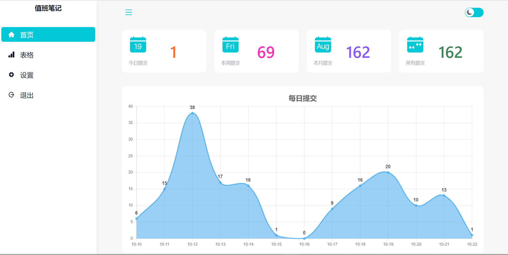

<h1>值班笔记后台前端 </h1>

## 1. 预览



## 2. 部署

### 2.1 一键部署

```bash
docker run --restart=unless-stopped -p 8089:3000 -d --name punch-frontend mraddict063/punch-frontend
```

### 2.2 dokcer-compose版

克隆文档：

```bash
git clone https://github.com/MR-Addict/punch-frontend.git
```

部署文档：

```bash
docker-compose up -d
```
